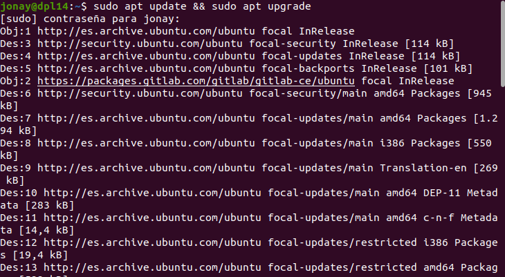

# Wild Fly


## 1. Introducción.
En este ejemplo se va a mostrar como instalar y configura WildFly. WildFly o JBoss es un servidor de aplicaciones Java de código abierto y multiplataforma, esta basado en estándar EE y proporciona un entorno para el despliegue y mantenimiento de aplicaciones. Algunas de sus características mas destacadas son:

    • La velocidad de arranque.
    • Web server de alto rendimiento, que nos aporta conectividad y escalabilidad para nuestra aplicaciones.
    • Mejoras de uso de memoria.
    • Fácil de configurar.
    • Soporta REST, JAX-RS 2, JSON-P, entre otros.
    • Facilita la testabilidad de las aplicaciones.
    • Es Open Source.
    
## 2. Requisitos Sistema.
Sera instalado en un servidor Ubuntu 20.04.

Ya que WildFly esta desarrollado en Java requiere JDK para su funcionamiento. Aparte para mejorar se instalar MAVEN junto con JDK.

## 3. Instalación.
Antes de instalar nada es recomendable actualizar tanto los paquetes de servidor como el sistema.
Ejecutamos el siguiente comando:
```
  sudo apt update && sudo apt upgrade
```




Ahora vamos a la pagina oficial y descargamos la ultima versión estable. En este caso se va a descargar con wget en terminal que nos descargara un paquete en formato tar.gz,
En el terminal ejecutamos:
```
wget https://github.com/wildfly/wildfly/releases/download/25.0.0.Final/wildfly-25.0.0.Final.tar.gz
```


Para preparar el entrono queremos que el  servicio use su propio usuario y grupo para ello vamos crearlos.
Crear el grupo y usuario:
```
sudo groupadd -r wildfly
sudo useradd -r wildfly -d optwildfly -s /sbin/nologin wildfly
```


Con el grupo y el usuario creado vamos a descomprimir el paquete que nos hemos descargado y moverlo a la carpeta “/opt”.
```
tar -xvzf wildfly-25.0.0.Final.tar.gz
sudo mv wildfly-25.0.0.Final /opt/wildfly-25.0.0.Final
```


Damos permisos al usuario y grupo:
```
sudo chown -R wildfly:wildfly /opt/wildfly
sudo chown -R wildfly:wildfly /opt/wildfly/
```


Configuramos el servicio:
```
sudo mkdir -p /etc/wildfly
sudo cp /opt/wildfly/docs/contrib/scripts/systemd/wildfly.conf /etc/wildfly/
```


Comprobamos el fichero de configuración de arranque.
```
sudo nano /etc/wildfly/wildfly.conf
```


Lanzamos los comando siguientes para configurar el arranque.
```
sudo cp /opt/wildfly/docs/contrib/scripts/systemd/launch.sh /opt/wildfly/bin/
```


```
sudo sh -c 'chmod +x /opt/wildfly/bin/*.sh'
```


```
sudo cp /opt/wildfly/docs/contrib/scripts/systemd/wildfly.service /etc/systemd/system/
```


```
sudo systemctl daemon-reload
```


Iniciamos y comprobamos el servicio.
```
sudo systemctl start wildfly
sudo systemctl status wildfly
```


Y hacemos que se iniciar automáticamente al arrancar el servidor.
```
sudo systemctl enable wildfly
```


## 4. Configurar WildFly.
Vamos a cambiar el puerto por defecto que es 8080 por un puerto especifico. Hemos modificado el puerto 8080a el 8084. Para modificarlo cambiamos la siguiente linea en el fichero “/opt/wildfly/standalone/configuration/standalone.xml”


Y permitimos el trafico en el cortafuego.
```
sudo ufw allow 8084/tcp 
```


Ya deberíamos poder acceder a WildFly desde un navegador.


### 4.1 Acceso.
En este punto vamos a añadir un usuario con con las capacidad administrativas, para ello debemos lanzar:
sudo /opt/wildfly/bin/add-user.sh

Seleccionamos el nombre del usuario y la contraseña.


### 4.2 Gestión de la consola
Accedemos a el siguiente fichero para comprobar que la IP de acceso es 0.0.0.0. , esto significa que al arrancar la maquina cojera la IP que se le asigne.

 


Ahora si accedemos a “/opt/wildfly/bin/launch.sh”  para comprobar que indica en que modo que lanza el servidor.


Ahora vamos a añadir la siguiente linea en el fichero “/etc/systemd/system/wilfly.service” como se describe los pasos de la posterior imagen.
```
  ExecStart=/opt/wildfly/bin/launch.sh $WILDFLY_MODE $WILDFLY_CONFIG $WILDFLY_BIND $WILDFLY_CONSOLE_BIND
```


Los pasos a seguir junto a la modificación anterior.


Según lo que queremos podemos modificar le siguiente fichero comentando la linea marcada o añadiendo 0.0.0.0 o 127.0.0.1


Con toda esta configuración ya tendremos instalado y configurado WildFly, si accedemos a la ip de nuestro equipo seguido del puerto y añadimos “/console”, podremos acceder a la consola de administración de WildFly usando el usuario y contraseña con permisos de administración.


