# Instalación de servicios REST/WS Wildfly

## 1. Introducción.
En esta practica vamos a desplegar dos aplicaciones en WildFly. La primera es una aplicación con simple Hello World usando JAX-RS (Java API for RESTful Web Service) y la segunda una demostración de Hello World usando JAX-WS Web Service.

Para poder realizar la siguiente practica se entiende que tendremos que tener instalado Java (JDK pertinente) + MAVEN ademas de WildFly instalado y configurado como consola de administración.

## 2. Servicio helloworld-rs.
Primero vamos a desplegar la aplicaciones RESTful, para ello vamos a descargarnos el proyecto en la siguiente página: WildFly quickstart.
Una vez descargado vamos a acceder al proyecto y lanzar “mvn clean install” para limpiar y generar el WAR de nuestra app.

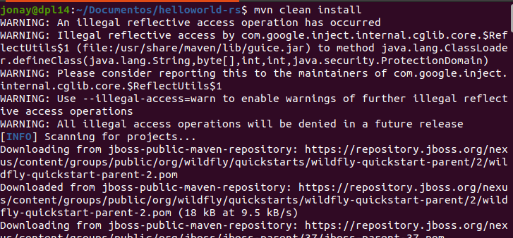

Ahora que tenemos el WAR vamos a acceder a la consola de administración de WildFly con “ip_servidor:puerto/console” y ponemos el usuario y contraseña con permisos de administración de WildFly.

Ya dentro seleccionamos “start” en Deployments.

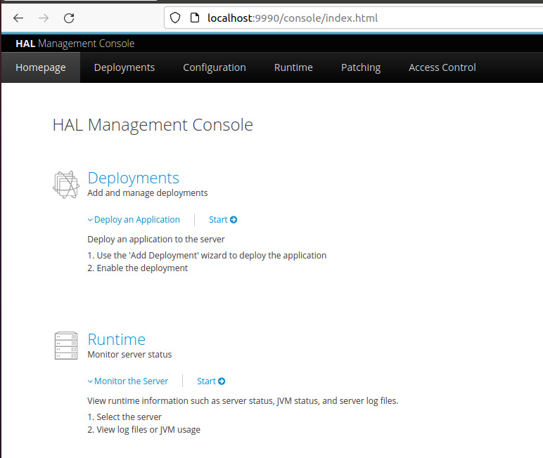

Ya en deployment apretamos en el +.

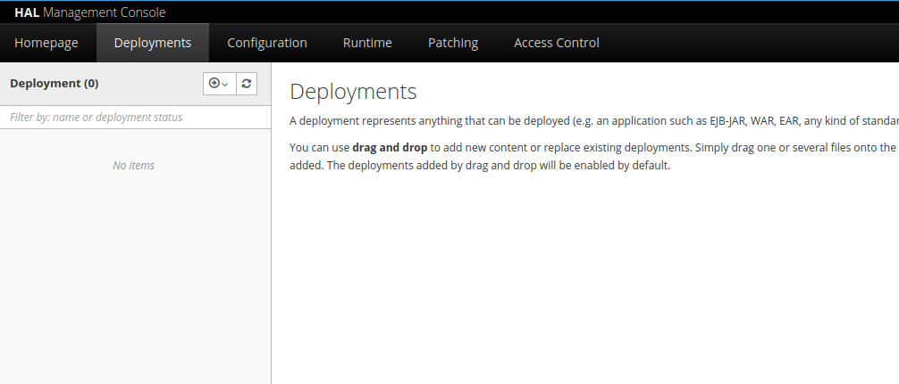

Ya aquí añadimos el .war .

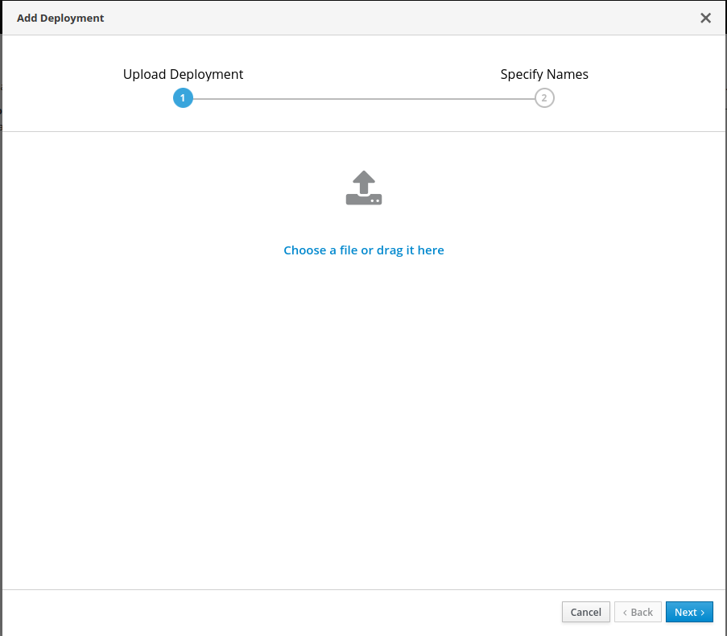

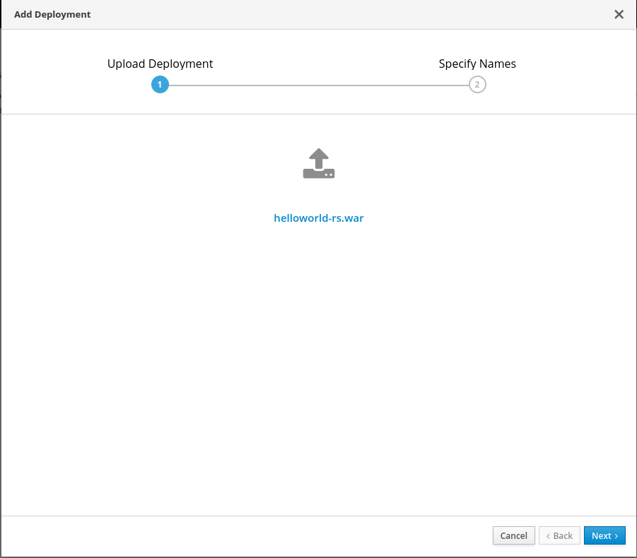

Le damos a continuar y vemos como podemos cambiar el nombre o el nombre de ejecución. Al terminar de cambiarlos o dejarlos como están le damos a “Finish”

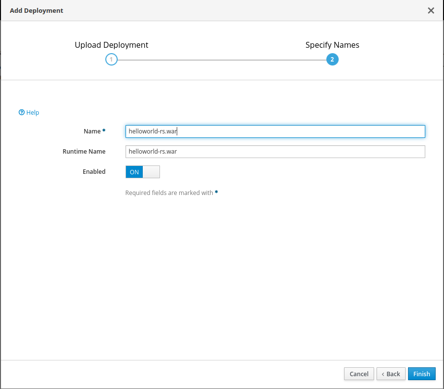

Y veremos algo como lo siguiente.

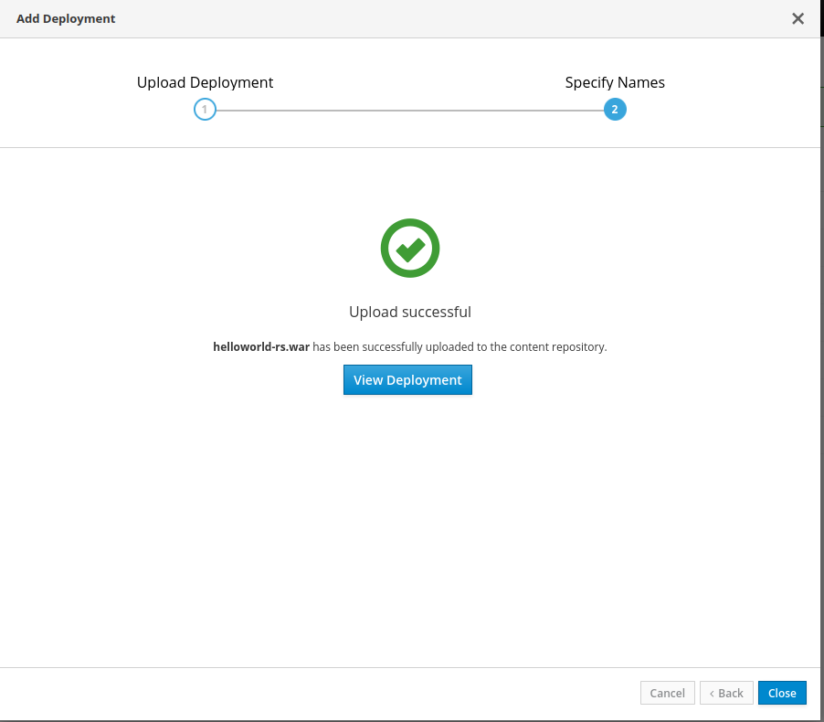

Cerramos y podremos ver los atributos del proyecto que hemos delegado.

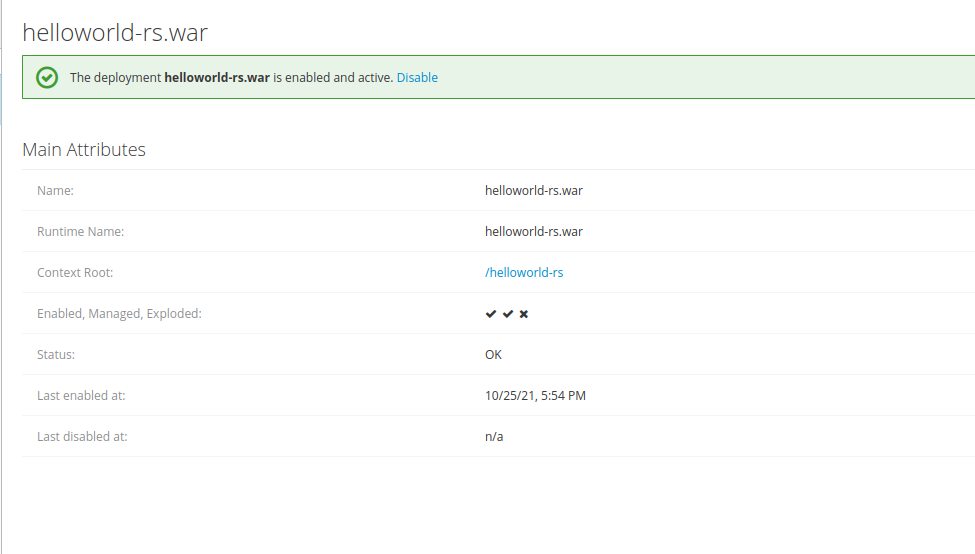

Y si accedemos al root del proyecto lo veremos desplegado.

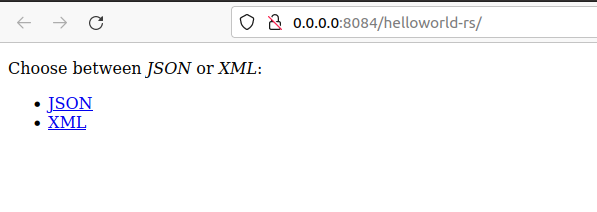

## 3. Servicio helloworld-ws.
Segundo vamos a desplegar la aplicaciones JAX-WS , para ello vamos a descargarnos el proyecto en la página pagina: WildFly quickstart.
Una vez descargado vamos a acceder al proyecto y lanzar “mvn clean install” para limpiar y generar el WAR de nuestra app.

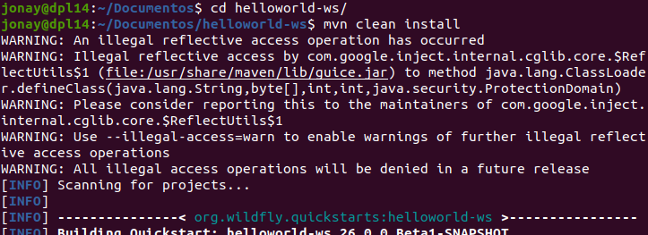

Ahora que tenemos el WAR vamos a acceder a la consola de administración de WildFly con “ip_servidor:puerto/console” como hemos echo ya  Y en deployment apretamos en el + y lo añadimos.

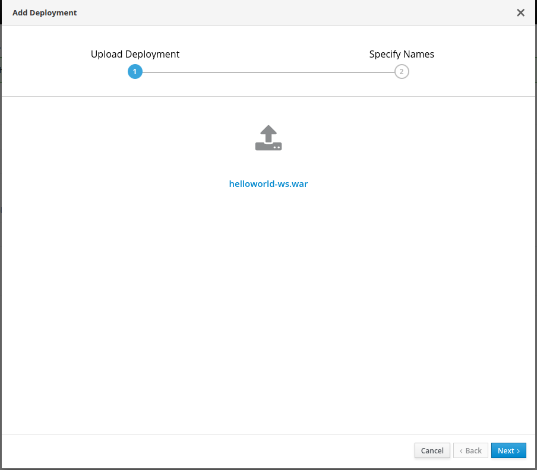

Ventana donde podemos especificar los nombres de la aplicación.

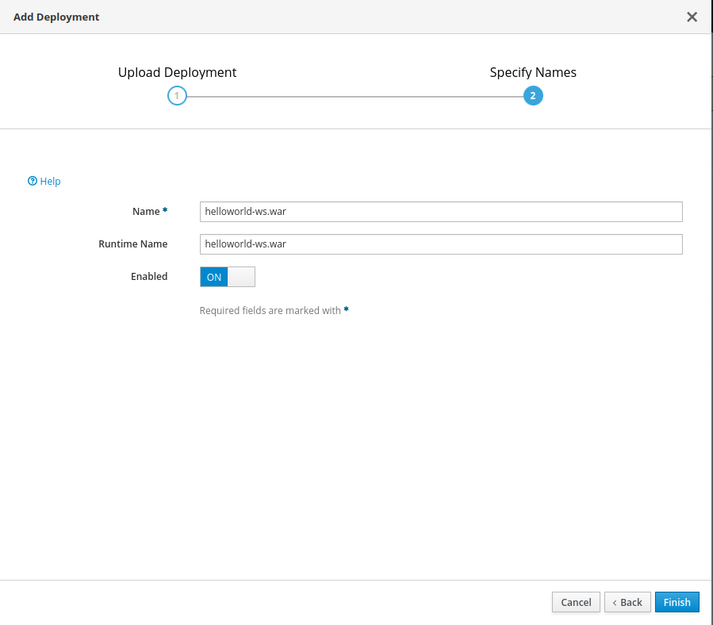

Veremos algo como lo siguiente.

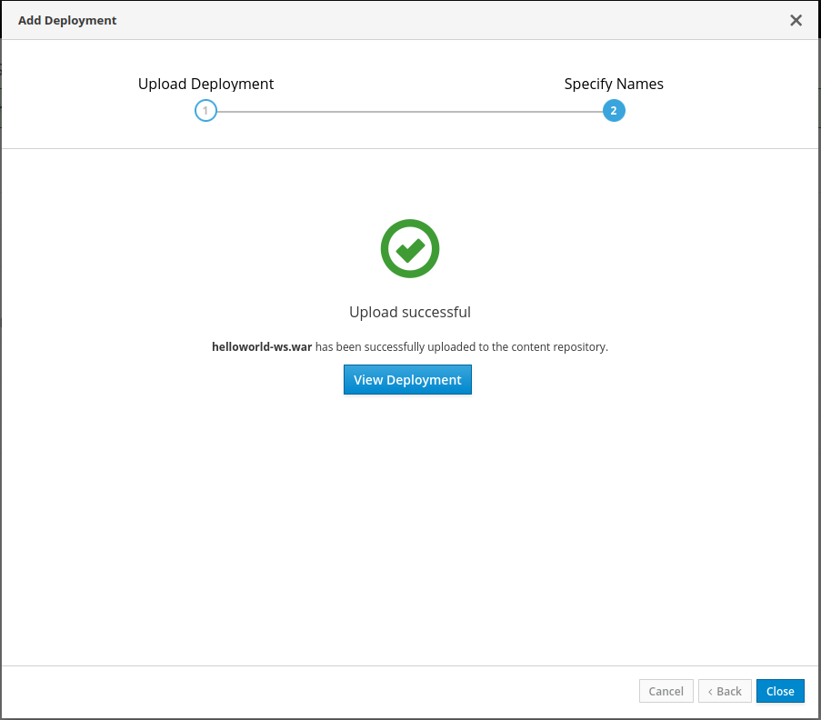

Cerramos y podremos ver los atributos del proyecto que hemos delegado.

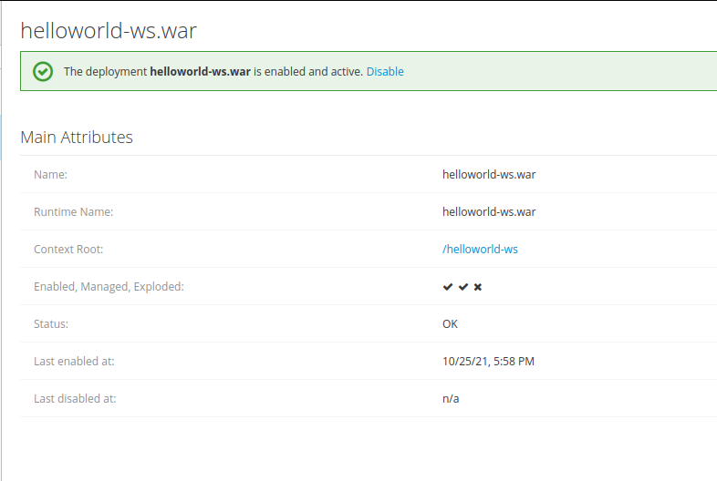

Y si accedemos al root del proyecto lo veremos desplegado.

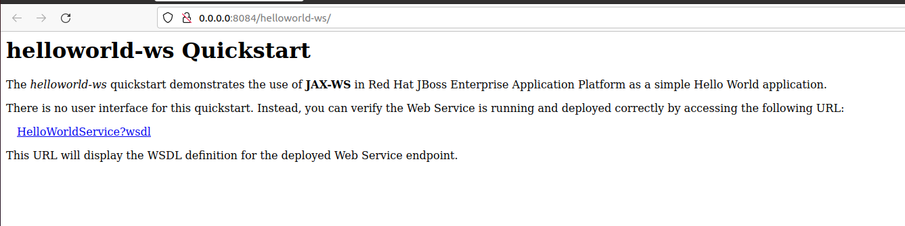
